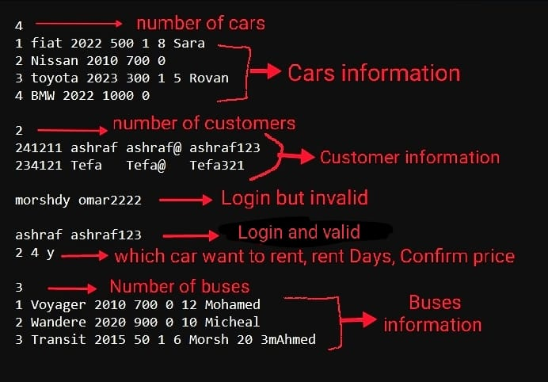
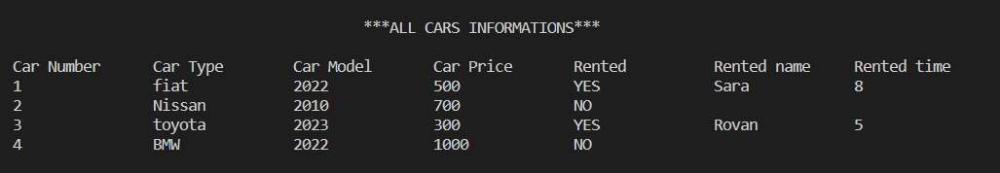
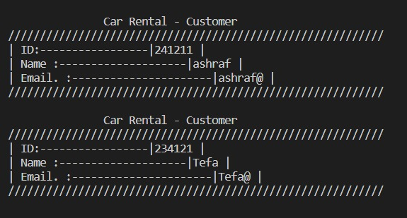
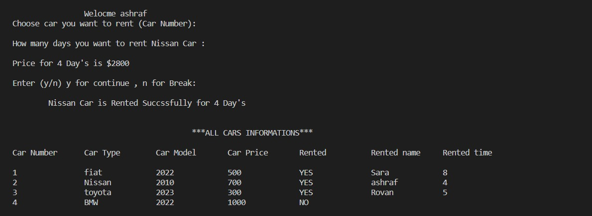
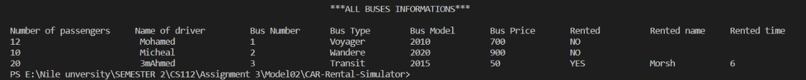

# CAR-Rental-Simulator
Assignment 3 CS112 Nile university

## Team Information:

This section contains all team names and IDs.
  
  −	Mohamed Youssef Hafez (211000565)
  
  −	Rovan Ehab (211000559)
  
  −	Omar Morshdy (211001749)
  
  −	Sara Aboalyazeed (211001641)
  
  −	Michael Hany (211001760)

## Application Description:
  This is a simple car rental system that allows the user to enter his information/login to the system, choose between our selection of cars, check whether a car is        rented or not, and finally rent it.
  
## Flowchart of execution sequence: 

https://my.visme.co/view/x43xk0nd-voql9kmgqvmp2x1w

## Sample input and output screen: 

### Input

### Output
#### Cars Information before rent

#### Customer Information

#### Cars Information after rent

#### Buses Information

